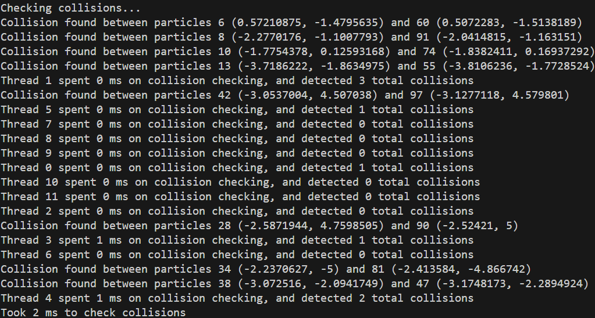

# Rust lab G - Particle collisions

## Q1: Colliding particles

### Question(s)


### Solution(s) & sample outputs

New data in `Particle` struct:

```rs
id: usize
```

New function in `ParticleSystem` struct:

```rs
pub fn collide_particles(&mut self) {
    let list_len = self.particles.len();
    let thread_count = 1;
    let mut collision_pool = scoped_threadpool::Pool::new(thread_count);

    println!("Checking collisions...");
    let start_time = time::Instant::now();

    collision_pool.scoped(|scope| {
        let mut thread_id = 0usize;
        let clone = self.particles.clone();
        scope.execute(move || thread_collide(&clone, thread_id));
        thread_id += 1;
    });

    let duration = time::Instant::now().duration_since(start_time);
    println!("Took {} ms to check collisions", duration.as_millis());
}
```

New `thread` function for collision:

```rs
fn thread_collide(list: &Vec<Particle>, particles_per_thread: usize, thread_id: usize) {
    let start_time = time::Instant::now();
    let list_size = list.len();
    let mut collision_count = 0;

    let mut clone = list.clone();
    let chunk = clone.chunks_mut(particles_per_thread).nth(thread_id).unwrap();

    for i in 0..particles_per_thread - 1 {
        let i_id = chunk[i].id;
        for j in i_id + 1..list_size {
            // Skip if comparing to self
            if (i_id == j) {
                continue;
            }

            if (chunk[i].collide(&list[j])) {
                collision_count += 1;
                println!("Collision found between particles {} ({}, {}) and {} ({}, {})", i_id, chunk[i].x, chunk[i].y, j, list[j].x, list[j].y);
            }
        }
    }

    let duration = time::Instant::now().duration_since(start_time);
    println!("Thread {} spent {} ms on collision checking, and detected {} total collisions", thread_id, duration.as_millis(), collision_count);
}
```

Order of calling in `main`:

```rs
particle_system.move_particles_loop();
particle_system.collide_particles();
```

Output with 1 thread:


Output with 12 threads:



Due to the scoped threadpools, the collision checks are only run AFTER all movements are performed. As such, no iteration has been included in the function.

At present, no locks or race conditions appear. However, if the collisions were running at the same time as the movements, or a non-atomic combined collision counter was present, those would both be cause for concern, as the program may attempt to read data being written (if no protection is present), or increment the collision counter at the same time as another thread.

The process of checking collisions was optimised by starting the partner check `j` at the value of `i_id`, or the position of `i` in the original vector. This prevents 1 collision from turning into 2 because of being detected on both particles, and decreases time spent processing checks that have already been completed.

### Reflection

By completing this exercise I have learned how to run comparisons on a single list across one or multiple threads through the use of chunks & list copies.

<br></br>

## Q2: Recording collisions using an Atomic

### Question(s)


### Solutions & sample outputs

New data within `ParticleSystem` struct:

```rs
collision_counter: Arc<AtomicUsize>
```

Initialiser:

```rs
collision_counter: Arc::new(AtomicUsize::new(0))
```

Modified threadpool initialisation:

```rs
for i in 0..thread_count {
    let clone = self.particles.clone();
    let counter_clone = Arc::clone(&self.collision_counter);
    scope.execute(move || thread_collide(&clone, &counter_clone, particles_per_thread, thread_id));
    thread_id += 1;
}
```

Modified increment code:

```rs
collision_count.fetch_add(1, Ordering::Relaxed);
```

Output:


Note the new total collsion line at the bottom.

### Reflection

Through this exercise I learned how to use Atomics to allow for safely combined counting across multiple threads.

<br></br>

## Q3: Ownership

### Question(s)


### Solutions & sample outputs

The reason the threads cannot currently be executed simultaneously is because they are initialised in different thread pools and then the threads run all iterations for the movement process, meaning the collision thread never has a chance to run until all movements are complete.

A solution to this could possibly be moving the iterations into the method creating and running the threadpools, as once the threadpool is created, the threads should not need to be re-initialised, meaning the threadpools could both be executed within one iteration before moving on to the next.

### Reflection

<br></br>