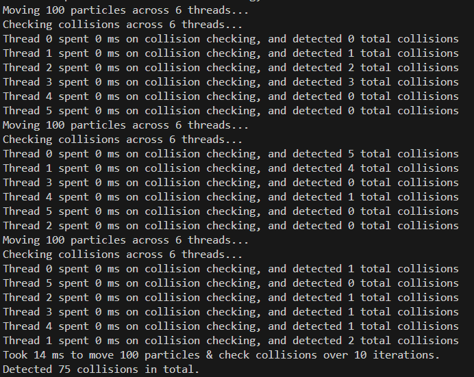
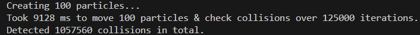

# Rust lab G - Particle collisions

## Q1: Colliding particles

### Question(s)


### Solution(s) & sample outputs

New data in `Particle` struct:

```rs
id: usize
```

New function in `ParticleSystem` struct:

```rs
pub fn collide_particles(&mut self) {
    let list_len = self.particles.len();
    let thread_count = 1;
    let mut collision_pool = scoped_threadpool::Pool::new(thread_count);

    println!("Checking collisions...");
    let start_time = time::Instant::now();

    collision_pool.scoped(|scope| {
        let mut thread_id = 0usize;
        let clone = self.particles.clone();
        scope.execute(move || thread_collide(&clone, thread_id));
        thread_id += 1;
    });

    let duration = time::Instant::now().duration_since(start_time);
    println!("Took {} ms to check collisions", duration.as_millis());
}
```

New `thread` function for collision:

```rs
fn thread_collide(list: &Vec<Particle>, particles_per_thread: usize, thread_id: usize) {
    let start_time = time::Instant::now();
    let list_size = list.len();
    let mut collision_count = 0;

    let mut clone = list.clone();
    let chunk = clone.chunks_mut(particles_per_thread).nth(thread_id).unwrap();

    for i in 0..particles_per_thread - 1 {
        let i_id = chunk[i].id;
        for j in i_id + 1..list_size {
            // Skip if comparing to self
            if (i_id == j) {
                continue;
            }

            if (chunk[i].collide(&list[j])) {
                collision_count += 1;
                println!("Collision found between particles {} ({}, {}) and {} ({}, {})", i_id, chunk[i].x, chunk[i].y, j, list[j].x, list[j].y);
            }
        }
    }

    let duration = time::Instant::now().duration_since(start_time);
    println!("Thread {} spent {} ms on collision checking, and detected {} total collisions", thread_id, duration.as_millis(), collision_count);
}
```

Order of calling in `main`:

```rs
particle_system.move_particles_loop();
particle_system.collide_particles();
```

Output with 1 thread:


Output with 12 threads:


Due to the scoped threadpools, the collision checks are only run AFTER all movements are performed. As such, no iteration has been included in the function.

At present, no locks are required and no race conditions appear. However, if the collisions were running at the same time as the movements, or a combined collision counter was present, those would likely both be cause for concern (especially the latter), as the program may attempt to read data being written (if no protection is present), or increment the collision counter at the same time as another thread.

The process of checking collisions was optimised by starting the partner check `j` at the value of `i_id`, or the position of `i` in the original vector. This prevents 1 collision from turning into 2 because of being detected on both particles, and decreases time spent processing checks that have already been completed.

### Reflection

By completing this exercise I have learned how to run comparisons on a single list across one or multiple threads through the use of chunks & list copies.

<br></br>

## Q2: Recording collisions using an Atomic

### Question(s)


### Solutions & sample outputs

New data within `ParticleSystem` struct:

```rs
collision_counter: Arc<AtomicUsize>
```

Initialiser:

```rs
collision_counter: Arc::new(AtomicUsize::new(0))
```

Modified threadpool initialisation:

```rs
for i in 0..thread_count {
    let clone = self.particles.clone();
    let counter_clone = Arc::clone(&self.collision_counter);
    scope.execute(move || thread_collide(&clone, &counter_clone, particles_per_thread, thread_id));
    thread_id += 1;
}
```

Modified increment code:

```rs
collision_count.fetch_add(1, Ordering::Relaxed);
```

Output:


Note the new total collsion line at the bottom.

### Reflection

Through this exercise I learned how to use Atomics to allow for safely combined counting across multiple threads.

<br></br>

## Q3: Ownership

### Question(s)


### Solutions & sample outputs

The reason the threads cannot currently be executed simultaneously is because they are initialised in different thread pools and then the threads run all iterations for the movement process, meaning the collision thread never has a chance to run until all movements are complete.

A solution to this could possibly be moving the iterations into the method creating and running the threadpools, as once the threadpool is created, the threads should not need to be re-initialised, meaning the threadpools could both be executed within one iteration before moving on to the next.

Code:

```rs
pub fn move_and_collide_particles(&mut self) {
    let num_iterations = 10;
    let num_threads_total = 12;
    let num_threads_movement = 6;
    let num_threads_collision = num_threads_total - num_threads_movement;
    let num_particles_total = self.particles.len();
    let num_particles_movement = num_particles_total / num_threads_movement;
    let num_particles_collision = num_particles_total / num_threads_collision;

    let start_time = time::Instant::now();

    // Set up thread pools
    let mut pool_movement = scoped_threadpool::Pool::new(num_threads_movement as u32);
    let mut pool_collision = scoped_threadpool::Pool::new(num_threads_collision as u32);

    // Iteratively run threads
    for i in 0..num_iterations {
        // Run movement threads
        println!("Moving {} particles across {} threads...", self.particles.len(), num_threads_movement);
        pool_movement.scoped(|scope| {
            let mut thread_id = 0usize;
            for chunk in self.particles.chunks_mut(num_particles_movement) {
                scope.execute(move || thread_main(chunk, 1, thread_id));
                thread_id += 1;
            }
        });

        // Run collision threads
        println!("Checking collisions across {} threads...", num_threads_collision);
        pool_collision.scoped(|scope| {
            let mut thread_id = 0usize;
            for i in 0..num_threads_collision {
                let list_clone = self.particles.clone();
                let collision_counter_clone = Arc::clone(&self.collision_counter);
                scope.execute(move || thread_collide(&list_clone, &collision_counter_clone, num_particles_collision, thread_id));
                thread_id += 1;
            }
        });
    }

    let duration = time::Instant::now().duration_since(start_time);
    println!("Took {} ms to move {} particles & check collisions over {} iterations.", duration.as_millis(), num_particles_total, num_iterations);
    println!("Detected {} collisions in total.", self.collision_counter.load(Ordering::Relaxed));
}
```

Output w/ 6 threads for movement & 6 threads for collision:



Without debug outputs, it takes around 125,000 iterations to achieve 10 seconds of runtime with this configuration:


After testing with different thread weights (on 12 threads), it appears the program runs fastest with 2 threads allocated to movement, and 10 threads allocated to collision:



Evidently, allocating more of the threads to the collision side of the program provides a considerable performance increase, as it is more computationally intensive than the movement side.

### Reflection

Through this exercise I have become more familiar with how to order processes in such a way that allows multiple multi-threaded processes to run alongside one another in a somewhat rudimentary manner, but one that appears to be robust with data accessing.

I have also gained an understanding of weighting threads so that more computationally intensive tasks are allocated more threads to improve performance.

<br></br>