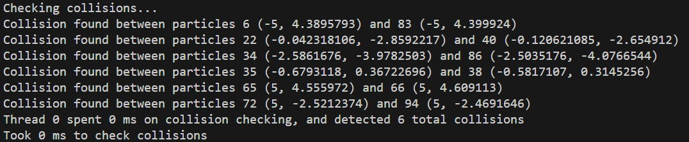
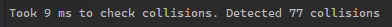

# Rust lab G - Particle collisions

## Q1: Colliding particles

### Question(s)


### Solution(s) & sample outputs

New data in `Particle` struct:

```rs
id: usize
```

New function in `ParticleSystem` struct:

```rs
pub fn collide_particles(&mut self) {
    let list_len = self.particles.len();
    let thread_count = 1;
    let mut collision_pool = scoped_threadpool::Pool::new(thread_count);

    println!("Checking collisions...");
    let start_time = time::Instant::now();

    collision_pool.scoped(|scope| {
        let mut thread_id = 0usize;
        let clone = self.particles.clone();
        scope.execute(move || thread_collide(&clone, thread_id));
        thread_id += 1;
    });

    let duration = time::Instant::now().duration_since(start_time);
    println!("Took {} ms to check collisions", duration.as_millis());
}
```

New `thread_main` method for collision:

```rs
fn thread_collide(list: &Vec<Particle>, thread_id: usize) {
    let start_time = time::Instant::now();
    let list_size = list.len();
    let mut collision_count = 0;
    for i in 0..list_size - 1 {
        // Due to the progression of i, j doesn't need to iterate through previous values of i.
        for j in i + 1..list_size {
            if (list[i].collide(&list[j])) {
                collision_count += 1;
                println!("Collision found between particles {} ({}, {}) and {}! ({}, {})", i, list[i].x, list[i].y, j, list[j].x, list[j].y);
            }
        }
    }

    let duration = time::Instant::now().duration_since(start_time);
    println!("Thread {} spent {} ms on collision checking, and detected {} total collisions", thread_id, duration.as_millis(), collision_count);
}
```

Order of calling in `main`:

```rs
particle_system.move_particles_loop();
particle_system.collide_particles();
```

Output:



Attempting to perform the same process with multiple threads:


Secondary threads perform calculations incorrectly, likely due to a race condition. Attempting to apply mutex locks caused the entire process to lock up, since the `i`th particles were locked, meaning if the `j`th value is encountered, a thread would be unable to progress.

### Reflection

By completing this exercise I have learned about the difficulty of multithreading comparisons on a list in Rust, and how race conditions can break the functionality of a program without necessarily causing any errors.

<br></br>

## Q2: Recording collisions using an Atomic

### Question(s)


### Solutions & sample outputs

New data within `ParticleSystem` struct:

```rs
collision_counter: Arc<AtomicUsize>
```

Initialiser:

```rs
collision_counter: Arc::new(AtomicUsize::new(0))
```

Modified threadpool initialisation:

```rs
for i in 0..thread_count {
    let clone = self.particles.clone();
    let counter_clone = Arc::clone(&self.collision_counter);
    scope.execute(move || thread_collide(&clone, &counter_clone, particles_per_thread, thread_id));
    thread_id += 1;
}
```

Modified increment code:

```rs
collision_count.fetch_add(1, Ordering::Relaxed);
```

Output:



(This is still with the race condition occuring)

### Reflection

Through this exercise I learned how to use Atomics to allow for counting across multiple threads.

<br></br>